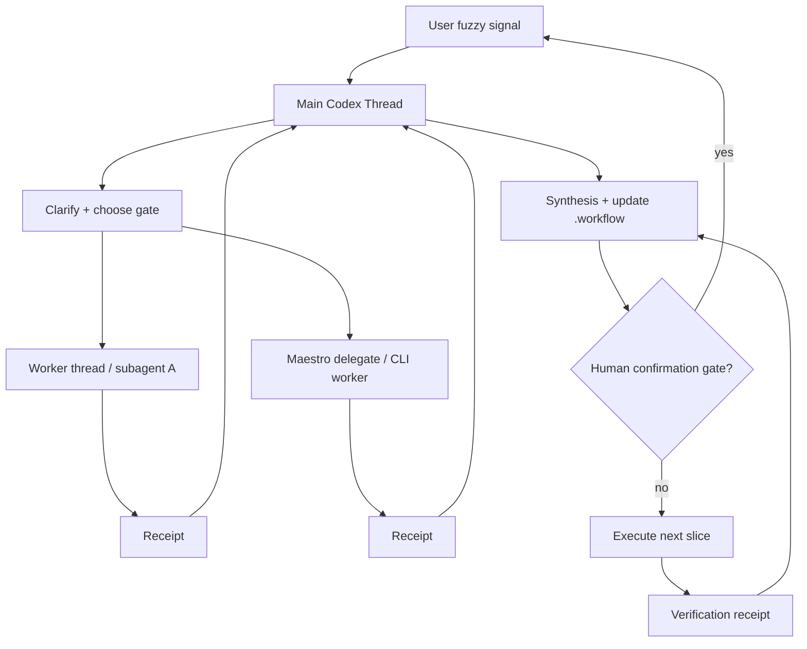

# Codex + Maestro 个人开发操作系统 v1

> Scope: 通用开发方法论，用 OzonERP / Canvas 二开作为案例。
> Date: 2026-06-18
> Status: draft for review
> Sources: Maestro-Flow official repository guides, local OzonERP workflow documents, current Codex App capabilities observed in this session.

## 0. 先说结论

你要解决的不是“不会用某个命令”，也不是“规则不够多”。你的核心问题是：

```text
模糊想法
-> 反复澄清
-> 文档增加
-> 上下文压缩
-> 主线漂移
-> agent 做完一个窄任务
-> 结果不是你想要的产品工作流
```

所以 Maestro 对你有价值，但它不能当成“更聪明的自动 agent”。更准确地说：

```text
Codex 主 agent = 需求澄清 + 编排 + 收口 + 最终判断
Maestro = 生命周期/状态/命令链/质量门/委派/知识沉淀骨架
Ralph = 已有边界后的长生命周期推进器
子代理/worker = 独立证据、实现、验证执行者
```

默认策略不是 `maestro-ralph -y` 一路跑，而是：

```text
先澄清和分析
再形成 task brief
再用 Ralph / execute / worker 做窄任务
每个阶段有人工确认门和 verification receipt
```

一句话：你需要的是“半自动闭环”，不是“无人值守全自动”。

## 1. Maestro 能提供什么，不能提供什么

### 1.1 能提供

Maestro 官方文档里可复用的能力：

- `maestro-ralph`：自适应生命周期推进，能根据状态进入 `analyze -> plan -> execute -> verify -> review -> test` 等阶段。
- decision nodes：在 verify/review/test/milestone 后读结果，决定继续、debug、fix、retry 或暂停。
- `maestro delegate`：把分析/实现/审查委派给外部 CLI agent，支持异步、status、output、message。
- `maestro msg`：agent 消息总线，适合记录 worker 向 coordinator 的报告。
- `hooks`：会话启动注入、用户 prompt 感知、workflow guard、stop 续行等。注意 Windows/Codex hook 支持有限，不能作为唯一依赖。
- `spec / wiki / knowhow`：把规则、经验、模板、决策分层沉淀，减少 AGENTS.md 膨胀。
- `overlay`：不改原始命令，用补丁方式给 Maestro 命令加项目特定步骤和质量门。
- `worktree`：里程碑级隔离开发。
- `quality-*`：review、auto-test、UAT、debug、retrospective 等质量管线。
- `role routing`：用 analyze/review/implement/plan/brainstorm/research 等角色路由到不同 CLI 工具。

### 1.2 不能自动提供

这些必须由 Codex 主 agent 和你的协议补齐：

- 它不会天然知道你真正想要的产品方向。
- Ralph 不是需求澄清器，它是生命周期推进器。
- `-y` 会跳过确认，对你这种 UI/样本/生成图质量敏感任务很危险。
- Maestro delegate 不是 Codex App 原生子代理，也不会自动共享当前对话上下文。
- hooks 是守门员，不是产品经理。
- 消息总线可以传递结果，但不会替主 agent 判断结果是否对。
- 质量管线会跑测试，但测试不能替代你对 UI、样图、套图工作流的验收。

## 2. 你的默认开发状态机

把长任务固定成 T0-T7，不要每次重新发明流程。

```text
T0 Inbox
模糊输入、想法、抱怨、截图、旧文档、失败经验。

T1 Clarify
主 agent 复述目标、列不确定点、最多问 1-3 个问题。

T2 Evidence / Analyze
读样本、旧实现、代码、业务文档，输出证据和判断。

T3 Salvage
旧成果 keep / replay / rewrite / drop。

T4 Insertion Plan
决定接入点、数据合同、UI 工作流、失败状态、回滚点。

T5 Execution Plan / Visible Slice
写最小可见 vertical slice 的执行计划，然后实现。

T6 Manifest / Export / Persistence
把结果变成可追溯产物，比如 rendered_asset_id、ImageOutputManifest。

T7 Verification / Handoff
浏览器 smoke、截图、verification receipt、下一步。
```

OzonERP 的 Canvas 套图案例里，对应关系是：

```text
T1: clean Canvas v0.3.0 audit
T2A: 恢复完整 ecommerce suite workflow intent
T2B: v2/root FormGroupHandoff + 本地 1688png adapter
T2C: SuiteGenerationContext / source facts / slot gates / prompt grounding
T2D: Ozon hot-product/PDP 与 1688/source/local samples matrix
T3: old branch keep/replay/rewrite/drop
T4: Canvas v0.3.0 sidecar insertion plan
T5: 可见 group-to-suite generation slice，至少生成 1 张新图
T6: rendered_asset_id -> ImageOutputManifest/export
T7: browser smoke + screenshot evidence + verification receipt
```

## 3. 主 agent、Ralph、子代理怎么分工

### 3.1 主 agent

主 agent 永远负责：

- 需求澄清。
- 任务排序。
- 判断当前 gate。
- 选择是否使用 Maestro/Ralph/worker。
- 给 worker 写 task brief。
- 收口 worker 结果。
- 更新 `.workflow`。
- 判断能否进入下一阶段。
- 对最终结论负责。

主 agent 不能把产品方向外包给 worker。

### 3.2 Ralph

Ralph 适合：

- 已经有 `.workflow` 状态。
- 已经知道当前生命周期位置。
- 任务可以进入 `analyze -> plan -> execute -> verify`。
- 质量门失败时允许 debug/fix/retry。

Ralph 不适合：

- 你刚说“我不满意 UI”。
- 你还没选样本。
- 你还没确认套图验收标准。
- 你自己也说不清产品形态。
- 需要先挖旧文档、旧失败原因、样本差异。

### 3.3 子代理 / worker

worker 只做独立任务：

```text
读一个旧分支并输出 salvage matrix
分析一个 UI 流程并输出 ux_issue
审查一个 contract 并输出 pass/warn/block
实现一个 disjoint 文件范围
跑一组验证并输出 proves / does_not_prove
```

worker 不做：

```text
理解整个 ERP
决定产品方向
同时改多个共享模块
把长篇报告直接塞给用户
```

## 4. 硬闸门，而不是软规则

你已经有很多规则，但软规则容易被忽略。要把它们转成“没有产物就不能过门”的硬闸门。

### 4.1 模糊输入闸门

触发条件：

```text
UI 不满意
生成图不好
样本怎么选
业务主线不清
我想重做
我觉得跑偏
```

主 agent 必须输出：

```yaml
understood_goal:
uncertainties:
blocking_questions: [] # 最多 1-3 个
recommended_next_gate:
will_not_do_yet:
```

不能直接实现。

### 4.2 实现前闸门

进入实现前必须有：

```yaml
task_brief:
  claim_to_reduce:
  business_object:
  user_visible_output:
  allowed_files_or_scope:
  forbidden_claims:
  acceptance:
  verification_plan:
```

没有 task brief，不能开 `maestro-execute` 或 Ralph 自动跑。

### 4.3 UI / 生成图闸门

涉及 UI、套图、样图、视觉质量时，完成标准不能是“测试通过”。

必须有：

```yaml
visible_evidence:
  - screenshot
  - browser smoke
  - generated image path or preview
  - user acceptance point
does_not_prove:
  - seller-usable
  - listing-ready
  - platform-pass
```

### 4.4 verification receipt 闸门

任何完成态都必须写：

```yaml
proves:
does_not_prove:
evidence:
next:
```

这能防止“跑了一堆测试，但产品 claim 没被证明”。

## 5. 你平常该怎么说

下面这些是“自然语言入口指令”。它们不一定是 Maestro 原生 CLI 命令，而是你给 Codex 主 agent 的触发模板。

### 5.1 模糊需求澄清

```text
$maestro-clarify
我想做 X，但我说得可能很模糊。
先不要实现。
主 agent 先复述目标、列不确定点，最多问 3 个问题。
涉及 UI/样本/生成图质量时，先给验收标准草案。
```

### 5.2 长任务恢复

```text
$maestro-resume
按长任务协议继续。
先读取 .workflow/current.yaml、task.yaml、open_threads.yaml、verification.yaml。
告诉我 recovered goal、current gate、open threads、forbidden claims、推荐下一步。
不要重新排序，不要直接写代码。
```

### 5.3 分析阶段

```text
$maestro-analyze-gate
基于当前 .workflow 和相关文档，只做 T2/T3/T4 分析。
主 agent 编排 PM/FDE/Data/Test/Salvage 角色。
输出 evidence、decision draft、open_threads、does_not_prove。
不要实现产品 UI。
```

### 5.4 旧分支 salvage

```text
$maestro-salvage
读取旧分支作为 evidence，不作为新主线。
输出 keep / replay / rewrite / drop matrix。
必须说明每一项的证据路径、风险、是否进入 T4/T5。
```

### 5.5 UI 不满意

```text
$maestro-ux-issue
我不满意这个 UI。
不要马上改。
先转成 ux_issue：
业务对象、用户动作、痛点、验收标准、截图/浏览器验证方式、未回答点。
最多问我 1 个阻塞问题。
```

### 5.6 执行一个窄任务

```text
$maestro-ralph-task
只执行当前已确认 task brief 的最小 visible slice。
不允许扩大范围。
完成后给 verification receipt：
proves、does_not_prove、evidence、next。
```

### 5.7 压缩前保存

```text
$maestro-handoff
压缩前保存状态。
更新 current/task/open_threads/verification。
给下个会话第一句话。
不要只把结论留在聊天里。
```

### 5.8 跑偏纠正

```text
$maestro-stop-drift
你跑偏了。
停下：
1. 当前 gate 是什么；
2. 刚才偏离了哪个 task 或 claim；
3. 哪些 claim 没证据；
4. 回到哪个下一步；
5. 更新 open_threads。
```

## 6. 真正的 Maestro 命令怎么用

这些是终端或 slash 命令层面的概念。你不需要自己敲，主 agent 可以替你执行。

### 6.1 安装

```bash
npm install -g maestro-flow
maestro install
```

在 Codex/Cli 环境里，项目初始化通常应该放在独立 worktree，不要先污染根目录。

### 6.2 手动生命周期

适合你这种需要确认的任务：

```bash
/maestro-analyze "任务描述"
/maestro-plan
/maestro-execute
/quality-review
/quality-test
```

### 6.3 Ralph

适合边界清楚的完整 milestone：

```bash
/maestro-ralph "实现某个已确认的功能"
/maestro-ralph status
/maestro-ralph continue
```

慎用：

```bash
/maestro-ralph -y "..."
```

`-y` 只适合低风险、验收标准明确、不会牵涉 UI/样图/样本选择/业务主线的任务。

### 6.4 Delegate

适合外部 CLI worker：

```bash
maestro delegate "分析某模块" --role analyze --mode analysis --async
maestro delegate status <id>
maestro delegate output <id>
maestro delegate message <id> "补充上下文"
```

delegate 结果必须被主 agent 汇总进 `.workflow`，否则只是又多了一段会丢失的上下文。

### 6.5 Message bus

适合作为 worker 报告通道：

```bash
maestro msg send "task done..." -s <session> --from worker --to coordinator
maestro msg list -s <session> --last 10
maestro msg status -s <session>
```

但它不是主 agent 判断系统。消息只是证据。

## 7. 跨会话 / 多线程半自动闭环

Codex App 当前有线程能力：可以 list/read/send/fork/create/handoff 线程。Maestro 有 delegate 和 msg。两者可以组合，但边界要清楚。

推荐模型：



### 7.1 thread registry

如果用了多个 Codex 线程，维护：

```yaml
threads:
  - id: "<main-thread-id>"
    role: main
    owns:
      - orchestration
      - final synthesis
      - user confirmation gates

  - id: "<worker-thread-id>"
    role: worker
    task_id: T3
    scope: old branch salvage
    may_edit:
      - docs/plans/*salvage*
    must_not_edit:
      - .workflow/current.yaml
    report_to: "<main-thread-id>"
    status: running
```

建议路径：

```text
.workflow/thread_registry.yaml
```

### 7.2 worker receipt

每个 worker 必须回：

```yaml
task_id:
status: done|blocked|needs_review
artifact:
evidence:
decisions:
open_threads:
does_not_prove:
next:
```

主 agent 收口后才允许推进 gate。

### 7.3 是否能全自动

能做到“半自动闭环”：

- 主 agent 派发。
- worker 执行。
- worker 回 receipt。
- 主 agent 更新 `.workflow`。
- 下一个 worker 继续。

不建议做到“完全无人值守”：

- UI 审美需要你确认。
- 样本选择需要你确认。
- 商品事实边界需要你确认。
- 生成图质量需要你确认。
- Ozon/1688/51 外部平台写动作必须确认。

## 8. 上下文工程：文档该怎么沉淀

四层就够了：

```text
Global instructions
个人稳定习惯：模糊先澄清、主 agent 编排、不要只读自降级。

AGENTS.md
项目入口、读取顺序、任务边界、禁止 claims。

.workflow
当前状态、任务队列、open_threads、verification、thread registry。

docs / contracts / knowhow / specs
详细证据、合同、方案、复盘、可复用 recipe。
```

不要再让 `TODO.md`、`index.md`、`active.md`、handoff、聊天记录同时当主交接文件。

新文档必须标注类型：

```text
rule: 稳定规则
plan: 将来怎么做
contract: 数据/接口边界
evidence: 分析证据
receipt: 本轮证明了什么
knowhow: 可复用操作方法
```

## 9. UI 不满意时怎么变成 issue

你说“UI 不满意”时，主 agent 应该转成：

```yaml
type: ux_issue
business_object:
seller_action:
current_pain:
reference_or_counterexample:
acceptance:
  visible:
  interaction:
  density:
  failure_state:
verification:
  browser_screenshot:
  dom_check:
open_questions:
```

例子：

```yaml
type: ux_issue
business_object:
  - Ozon suite candidate
  - SKU group
seller_action: review source facts and generate four core suite images
current_pain:
  - user cannot see source facts vs style references
  - generated image quality has no review surface
  - backend result is invisible
acceptance:
  visible:
    - four core slots visible
    - source facts shown as confirmed/candidate/to_confirm
    - at least one newly generated image preview
  interaction:
    - user can reject/regenerate a slot
  failure_state:
    - blocked_claims visible instead of silently inventing facts
verification:
  - browser screenshot
  - generated image artifact path
```

这样 UI 反馈会变成可执行任务，而不是又加一句模糊规则。

## 10. OzonERP 案例：为什么之前二开失败

本地文档显示，高频失败不是“没写代码”，而是：

- 旧分支规则墙太重。
- 当前状态散在 TODO、index、active、handoff、聊天里。
- SourcePack-first `/image` UI 成了产品方向，但你真正要的是 Ozon 套图工作流。
- 后端合同和测试不少，但用户看不到结果。
- Canvas 能生成图，真正缺的是从 1688/source facts 到 Ozon-style suite candidate 的链路。
- Ozon 爆品样本和 1688 商品事实边界容易混淆。
- 多 agents 有了，但主 agent 没有持续收口。

所以新方式应该是：

```text
不要从旧分支继续堆功能
先用旧分支做 T3 salvage
新 worktree 里用薄 AGENTS + .workflow
T1-T4 分析关门后再 T5 visible slice
每次完成都写 verification receipt
```

## 11. OzonERP 新开发推荐流程

对 Canvas 套图工作流，建议第一个可见 slice：

```text
local 1688png package
-> selected group/SKU scope
-> source facts and blocked claims
-> 4 core slots
-> generated/reused/edited suite candidate
-> visible Canvas sidecar UI
-> draft CanvasProject/export package
-> ImageOutputManifest later in T6
```

不要把第一个 slice 做成：

```text
纯 backend contract
通用 Canvas 生图 demo
旧 SourcePack-first /image UI
listing-ready
platform-pass
```

## 12. 什么时候用 Ralph，什么时候不用

### 不用 Ralph，直接 Codex

```text
小 bug
单文件明确改动
文档小修
已有验收标准的小目标
```

### 用 main agent clarification

```text
你说不满意 UI
你说想重做
你说方向可能不对
你想分析旧失败
你不确定样本/验收
```

### 用 Maestro Analyze / Plan

```text
需要读很多文档
需要多角色分析
需要拆 task
需要形成 contract / plan
```

### 用 Ralph

```text
任务边界已确认
状态文件完整
验收标准明确
允许进入生命周期推进
```

### 用 Ralph `-y`

只在：

```text
低风险
不涉及 UI/样图/业务主线
不用用户确认
失败可自动 retry
```

## 13. hooks 怎么用

Windows/Codex 下不要把 hook 当唯一保障。可以作为补强。

适合的 hook：

- SessionStart：注入 `.workflow` 摘要。
- UserPromptSubmit：看到“继续/长任务/UI 不满意/生成图”时提醒读取协议。
- PreToolUse：阻止明显危险 shell 或越过 gate 的命令。
- Stop：如果任务未写 receipt，提醒/阻止结束。

不适合的 hook：

- 自动批准 UI 方向。
- 自动选择样本。
- 自动说 seller-usable。
- 每轮塞一大堆上下文。

## 14. 最小试点方案

不要一上来全自动。下一次试点只做这个：

```text
1. 选一个 dedicated worktree。
2. 主 agent 读取 .workflow。
3. 只做一个 analyze gate。
4. 输出 task brief。
5. 派一个 worker 做窄任务。
6. worker 返回 receipt。
7. 主 agent 更新 .workflow。
8. 如果涉及 UI/生成图，暂停给你看。
```

判断是否成功：

- 你有没有少重复解释？
- 压缩后能否恢复？
- worker 输出是否短而有证据？
- UI 反馈是否变成 ux_issue？
- 测试是否明确证明某个 claim？
- 没有提前说 seller-usable/listing-ready/platform-pass？

## 15. 我建议你的全局指令保留这些

全局只放稳定行为：

```text
当我的输入模糊时，先复述目标、列不确定点，最多问 1-3 个问题，不要直接实现。

主 agent 负责需求澄清、任务编排、子代理结果收口、上下文恢复和最终判断。

子代理只能做独立分析/实现/验证，不负责决定产品方向。

涉及 UI、生成图质量、样本选择、业务主线时，必须先确认验收标准。

长任务要拆成 3-7 个可恢复子任务，并维护 open_threads / verification。

本地项目、localhost、本地 API、本地数据库可以验证，不要自我降级成只读。
```

项目细节不要进全局，进项目 `.workflow` 和 docs。

## 16. 推荐你以后只记 5 句话

```text
1. 按长任务协议继续。
2. 先澄清，不要实现。
3. 转成 ux_issue。
4. 只做当前 task brief 的最小 visible slice。
5. 压缩前保存 current/task/open_threads/verification。
```

如果你只会这 5 句，主 agent 也应该能带着你走完整个流程。

## 17. 当前可确认来源

我这次参考了：

- `D:\Agents\.tmp\maestro-flow\README.zh-CN.md`
- `D:\Agents\.tmp\maestro-flow\guide\maestro-ralph-guide.md`
- `D:\Agents\.tmp\maestro-flow\guide\maestro-coordinator-guide.md`
- `D:\Agents\.tmp\maestro-flow\guide\delegate-async-guide.md`
- `D:\Agents\.tmp\maestro-flow\guide\cli-commands-guide.md`
- `D:\Agents\.tmp\maestro-flow\guide\hooks-guide-codex.md`
- `D:\Agents\.tmp\maestro-flow\guide\spec-system-guide.md`
- `D:\Agents\.tmp\maestro-flow\guide\overlay-guide.md`
- `D:\Agents\.tmp\maestro-flow\guide\worktree-guide.md`
- `D:\Agents\.tmp\maestro-flow\guide\quality-pipeline-guide.md`
- `D:\Agents\.tmp\maestro-flow\guide\role-routing-guide.md`
- `E:\ozon-erp\.worktrees\maestro-canvas-v030-lab\AGENTS.md`
- `E:\ozon-erp\.worktrees\maestro-canvas-v030-lab\.workflow\current.yaml`
- `E:\ozon-erp\.worktrees\maestro-canvas-v030-lab\.workflow\open_threads.yaml`
- `E:\ozon-erp\.worktrees\maestro-canvas-v030-lab\.workflow\verification.yaml`
- `E:\ozon-erp\.worktrees\maestro-canvas-v030-lab\docs\rules\codex-maestro-multi-thread-context-protocol.md`
- `E:\ozon-erp\.worktrees\maestro-canvas-v030-lab\docs\rules\long-task-interaction-protocol.md`
- `E:\ozon-erp\.worktrees\maestro-canvas-v030-lab\docs\rules\role-orchestration.md`
- `E:\ozon-erp\docs\plans\2026-06-17-development-sedimentation-and-maestro-worktree-method.md`

`https://linux.do/t/topic/2102464` 直接请求被 Cloudflare challenge 阻挡；本文没有把无法抓取的论坛正文当成确定来源。Maestro 相关判断主要来自作者 GitHub 仓库内的正式 guide。
